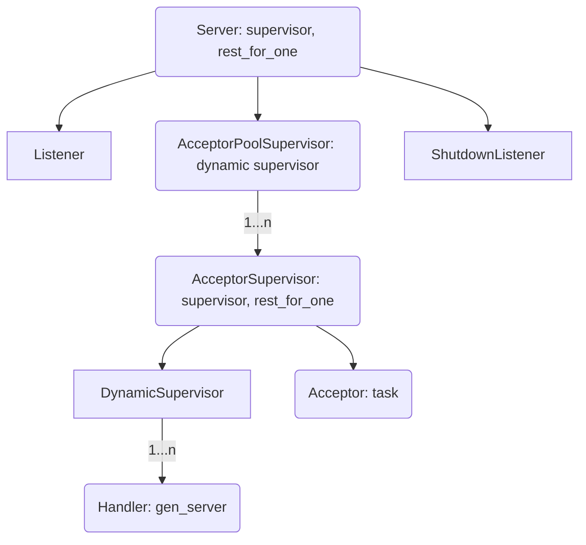

[](https://github.com/mtrudel/thousand_island/actions)
[](https://hexdocs.pm/thousand_island)
[](https://hex.pm/packages/thousand_island)

Thousand Island is a modern, pure Elixir socket server, inspired heavily by
[ranch](https://github.com/ninenines/ranch). It aims to be easy to understand
and reason about, while also being at least as stable and performant as alternatives.
Informal tests place ranch and Thousand Island at roughly the same level of
performance and overhead; short of synthetic scenarios on the busiest of servers,
they perform equally for all intents and purposes.

Thousand Island is written entirely in Elixir, and is nearly dependency-free (the
only library used is [telemetry](https://github.com/beam-telemetry/telemetry)).
The application strongly embraces OTP design principles, and emphasizes readable,
simple code. The hope is that as much as Thousand Island is capable of backing
the most demanding of services, it is also useful as a simple and approachable
reference for idiomatic OTP design patterns.

## Usage

Thousand Island is implemented as a supervision tree which is intended to be hosted
inside a host application, often as a dependency embedded within a higher-level
protocol library such as [Bandit](https://github.com/mtrudel/bandit). Aside from
supervising the Thousand Island process tree, applications interact with Thousand
Island primarily via the
[`ThousandIsland.Handler`](https://hexdocs.pm/thousand_island/ThousandIsland.Handler.html) behaviour.

### Handlers

The [`ThousandIsland.Handler`](https://hexdocs.pm/thousand_island/ThousandIsland.Handler.html) behaviour defines the interface that Thousand Island
uses to pass [`ThousandIsland.Socket`](https://hexdocs.pm/thousand_island/ThousandIsland.Socket.html)s up to the application level; together they
form the primary interface that most applications will have with Thousand Island.
Thousand Island comes with a few simple protocol handlers to serve as examples;
these can be found in the [examples](https://github.com/mtrudel/thousand_island/tree/main/examples)
folder of this project. A simple implementation would look like this:

```elixir
defmodule Echo do
  use ThousandIsland.Handler

  @impl ThousandIsland.Handler
  def handle_data(data, socket, state) do
    ThousandIsland.Socket.send(socket, data)
    {:continue, state}
  end
end

{:ok, pid} = ThousandIsland.start_link(port: 1234, handler_module: Echo)
```

For more information, please consult the [`ThousandIsland.Handler`](https://hexdocs.pm/thousand_island/ThousandIsland.Handler.html) documentation.

### Starting a Thousand Island Server

Thousand Island servers exist as a supervision tree, and are started by a call
to
[`ThousandIsland.start_link/1`](https://hexdocs.pm/thousand_island/ThousandIsland.html#start_link/1).
There are a number of options supported; for a complete description, consult the
[Thousand Island
docs](https://hexdocs.pm/thousand_island/ThousandIsland.html#t:options/0).

### Connection Draining & Shutdown

The `ThousandIsland.Server` process is just a standard `Supervisor`, so all the
usual rules regarding shutdown and shutdown timeouts apply. Immediately upon
beginning the shutdown sequence the `ThousandIsland.ShutdownListener` will cause
the listening socket to shut down, which in turn will cause all of the `Acceptor`
processes to shut down as well. At this point all that is left in the supervision
tree are several layers of Supervisors and whatever `Handler` processes were
in progress when shutdown was initiated. At this point, standard Supervisor shutdown
timeout semantics give existing connections a chance to finish things up. `Handler`
processes trap exit, so they continue running beyond shutdown until they either
complete or are `:brutal_kill`ed after their shutdown timeout expires.

The `shutdown_timeout` configuration option allows for fine grained control of
the shutdown timeout value. It defaults to 15000 ms.

### Logging & Telemetry

As a low-level library, Thousand Island purposely does not do any inline
logging of any kind. The [`ThousandIsland.Logger`](https://hexdocs.pm/thousand_island/ThousandIsland.Logger.html) module defines a number of
functions to aid in tracing connections at various log levels, and such logging
can be dynamically enabled and disabled against an already running server. This
logging is backed by telemetry events internally.

Thousand Island emits a rich set of telemetry events including spans for each
server, acceptor process, and individual client connection. These telemetry
events are documented in the [`ThousandIsland.Telemetry`](https://hexdocs.pm/thousand_island/ThousandIsland.Telemetry.html) module.

## Implementation Notes

At a top-level, a `Server` coordinates the processes involved in responding to
connections on a socket. A `Server` manages two top-level processes: a `Listener`
which is responsible for actually binding to the port and managing the resultant
listener socket, and an `AcceptorPoolSupervisor` which is responsible for managing
a pool of `AcceptorSupervisor` processes.

Each `AcceptorSupervisor` process (there are 100 by default) manages two processes:
an `Acceptor` which accepts connections made to the server's listener socket,
and a `DynamicSupervisor` which supervises the processes backing individual
client connections. Every time a client connects to the server's port, one of
the `Acceptor`s receives the connection in the form of a socket. It then creates
a new process based on the configured handler to manage this connection, and
immediately waits for another connection. It is worth noting that `Acceptor`
processes are long-lived, and normally live for the entire period that the
`Server` is running.

A handler process is tied to the lifecycle of a client connection, and is
only started when a client connects. The length of its lifetime beyond that of the
underlying connection is dependent on the behaviour of the configured Handler module.
In typical cases its lifetime is directly related to that of the underlying connection.

This hierarchical approach reduces the time connections spend waiting to be accepted,
and also reduces contention for `DynamicSupervisor` access when creating new
`Handler` processes. Each `AcceptorSupervisor` subtree functions nearly
autonomously, improving scalability and crash resiliency.

Graphically, this shakes out like so:



Thousand Island does not use named processes or other 'global' state internally
(other than telemetry event names). It is completely supported for a single node
to host any number of `Server` processes each listening on a different port.

## Contributing

Contributions to Thousand Island are very much welcome! Before undertaking any substantial work, please
open an issue on the project to discuss ideas and planned approaches so we can ensure we keep
progress moving in the same direction.

All contributors must agree and adhere to the project's [Code of
Conduct](https://github.com/mtrudel/thousand_island/blob/main/CODE_OF_CONDUCT.md).

Security disclosures should be handled per Thousand Island's published [security policy](https://github.com/mtrudel/thousand_island/blob/main/SECURITY.md).

## Installation

Thousand Island is [available in Hex](https://hex.pm/packages/thousand_island). The package
can be installed by adding `thousand_island` to your list of dependencies in `mix.exs`:

```elixir
def deps do
  [
    {:thousand_island, "~> 1.0"}
  ]
end
```

Documentation can be found at [https://hexdocs.pm/thousand_island](https://hexdocs.pm/thousand_island).

## License

MIT
